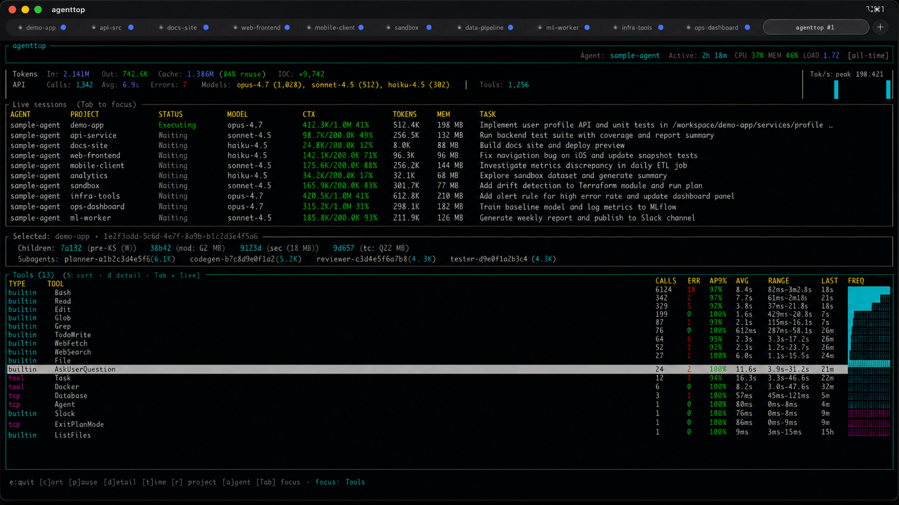

```
   ██████╗  ██████╗ ███████╗███╗   ██╗████████╗████████╗ ██████╗ ██████╗
  ██╔══██╗██╔════╝ ██╔════╝████╗  ██║╚══██╔══╝╚══██╔══╝██╔═══██╗██╔══██╗
  ███████║██║  ███╗█████╗  ██╔██╗ ██║   ██║      ██║   ██║   ██║██████╔╝
  ██╔══██║██║   ██║██╔══╝  ██║╚██╗██║   ██║      ██║   ██║   ██║██╔═══╝
  ██║  ██║╚██████╔╝███████╗██║ ╚████║   ██║      ██║   ╚██████╔╝██║
  ╚═╝  ╚═╝ ╚═════╝ ╚══════╝╚═╝  ╚═══╝   ╚═╝      ╚═╝    ╚═════╝ ╚═╝
```

<div align="center">

**htop for AI coding agents**


[](https://github.com/tech4242/agenttop/actions/workflows/ci.yml)
[](https://codecov.io/gh/tech4242/agenttop)
[](https://www.rust-lang.org/)
[](https://ratatui.rs/)
[](https://opensource.org/licenses/MIT)

[Quick Start](#quick-start) • [Features](#features) • [Configuration](#configuration) • [How It Works](#how-it-works)

</div>

---

A terminal-native observability dashboard for AI coding agents. Real-time visibility into tool usage, token consumption, and productivity metrics.



## Quick Start

```bash
# macOS
brew install tech4242/agenttop/agenttop

# Linux (downloads matching binary to ~/.local/bin)
curl -fsSL https://raw.githubusercontent.com/tech4242/agenttop/main/scripts/install.sh | sh

# Run it — auto-configures Claude Code, opens the dashboard
agenttop
```

That's it. agenttop detects Claude Code, writes the right OTEL env vars into `~/.claude/settings.json` (with a `.bak` first), starts the OTLP receiver on port 4318, and renders the TUI. On the next prompt to Claude, tool calls + token usage start streaming in.

Other agents (Codex, Gemini, Qwen, Cline, Copilot Chat, opencode) need a one-time setup — see [Configuration](#configuration).

## Origin Story

This is the spiritual successor of an MCP logging and monitoring tool that I was building over at https://github.com/tech4242/mcphawk. After realising that the tool needs to wrap every MCP server call in e.g. Claude configs and the fact that we can only log useful information for local calls due to various OS limitations (esp. on macOS), I gave it a rest. 

Then recently I realised that we have OTLP support in some these tools, so I wanted to build something simpler (like htop) that just focuses on tool and token usage. YMMV by tool and I am hoping to push these providers to squeeze out a little more of OTLP by exposing more metrics.

Having said that, see the Limitations and Supported Agents chapter below - long way to go but let's get started!

The goal: increase transparency in development without leaving your Terminal.

If you want to contribute, please let me know! 

## Supported Agents

| Agent | OTLP Support | Signals | MCP Tools | Key Metrics |
|-------|--------------|---------|-----------|-------------|
| **Claude Code** | ✅ Full | Metrics, Logs | Full names (auto-enabled via `OTEL_LOG_TOOL_DETAILS=1`) | tokens, cost, tools, LOC, compaction |
| **OpenAI Codex CLI** | ✅ Full (since Feb 2026) | Logs, Traces | Full names | tokens, tools, prompts |
| **Gemini CLI** | ✅ Full | Metrics, Logs | Full names + `tool_type` | 40+ metrics |
| **Qwen Code** | ✅ Full | Metrics, Logs | Supported | tokens, diff stats |
| **Cline** | ✅ Full (Cline Enterprise) | Logs, Metrics | via `use_mcp_tool` | `cline.turns.total`, tool calls |
| **GitHub Copilot Chat** | ✅ Full (since Feb 2026) | Metrics, Logs, Traces | Unconfirmed | OTel GenAI conventions (tokens, latency, model) |
| **opencode** | ⚠️ Plugin (`DEVtheOPS/opencode-plugin-otel`) | Logs, Metrics | mirrors Claude Code | tokens, tools |
| **Mistral Vibe** | ⚠️ Opt-out telemetry, OTLP path undocumented | — | — | — |
| **Cursor** | ❌ Proprietary | Admin API only | N/A | aggregate stats |
| **GitHub Copilot CLI** | ❌ Proprietary | REST API only | N/A | usage rates |
| **Aider** | ❌ None | — | — | — |

### Some notes on Limitations

#### MCP Tool Names (Claude Code)
Claude Code 2.1.128+ emits full MCP tool names (e.g. `mcp__context7__resolve-library-id`)
on `tool_result` events natively. The earlier limitation (tracked as
[anthropic/claude-code#17046](https://github.com/anthropics/claude-code/issues/17046))
was resolved on 2026-03-25. agenttop still sets `OTEL_LOG_TOOL_DETAILS=1` for
older versions, and the OTLP parser keeps the `tool_parameters` reconstitution
path as a fallback.

`tool_decision` events still emit a generic `tool_name = "mcp_tool"` (separate
upstream code path). agenttop reconciles decisions back to the correct MCP
name via `tool_use_id` when computing approval rates, so APR% is accurate per
MCP server even though the raw decision event isn't.

#### Context Window Usage
Claude Code's OTLP stream still doesn't carry live context-window usage,
but agenttop now scrapes it locally from `~/.claude/projects/.../*.jsonl`
and shows a `used/window` ratio in the **Live sessions** panel. **Compaction
events** (`event.name = "claude_code.compaction"`) are also tracked and
surfaced in the header with pre→post token deltas.

For the opus 200k-vs-1M variants (the 1M context is selected via API beta
header and not encoded in the transcript model name), agenttop auto-bumps
the window to 1M when observed usage exceeds 200k.

#### OpenAI Codex CLI
Historically `codex exec` and `codex mcp-server` emitted no telemetry
([openai/codex#12913](https://github.com/openai/codex/issues/12913)) — that
issue was closed as *completed* on 2026-02-28. We haven't independently
verified the new behavior end-to-end; if you hit gaps with your specific
Codex version, please open an issue with a sample event.

#### Approval Rate
Tool approval data is split across two Claude Code event types:
- `tool_result.decision_type = "accept"` is emitted for every accepted tool
  call (which is the only kind that actually executes and produces a result).
- `tool_decision.decision` is emitted for both `accept` and `reject` — and
  it's the *only* place rejections show up, because rejected tools never
  fire a `tool_result`.

agenttop combines both streams to compute APR%. Auto-approved tools (Read,
Glob, Grep, etc.) have no `tool_decision` events at all — those show 100%
APR by convention. If you see persistent 100% APR for a tool you actually
get prompted on, your Claude Code version may be on an older telemetry
schema (please report).


## Features

- **Multi-Agent Support** - Automatic detection of Claude Code, Gemini CLI, OpenAI Codex, Qwen Code, Cline, GitHub Copilot Chat, and opencode (via `service.name`)
- **Live Session Panel** - For Claude Code sessions scraped from `~/.claude/sessions/`: per-session status (Thinking / Executing / Waiting / RateLimited), current tool + arg, context window %, RSS, and any subagents
- **Rate-Limit Gauges** - 5-hour and 7-day Claude quota bars + reset countdown (requires `agenttop --setup claude` to install the StatusLine hook)
- **Token-rate Sparkline** - Tokens/sec over the last 5 minutes, bucketed into a braille sparkline
- **Host Vitals** - CPU%, MEM%, and 1-min load average in the header (cross-platform via `sysinfo`)
- **Open-Port + Orphan Tracking** - Ports opened by agent child processes; surfaces "orphan" ports left behind when a session dies
- **Project Filtering** - Auto-detects project from file paths, filter with `[r]`
- **Compaction Tracking** - Header shows compaction event count and last `pre→post` token delta (Claude Code 2026+)
- **Token Tracking** - Input, output, and cache token metrics
- **Unified Tool Table** - Built-in and MCP tools in one sortable table with a `TYPE` column (`builtin` / `mcp`). MCP tools shown as `server:tool` (e.g. `context7:resolve-library-id`). Per-tool:
  - Call count and error count
  - Approval rate (`APR%`)
  - Time since last call
  - Average duration and duration range
  - Relative frequency bar
- **Focus Switching** - `[Tab]` cycles focus between the Live sessions panel and the Tools table; `j/k`/arrows navigate whichever is focused
- **API Metrics** - API calls, latency, active time
- **Productivity Metrics** - Lines of code, commits
- **Cache Reuse Rate** - Prompt caching efficiency

## Other install methods

The [Quick Start](#quick-start) covers brew (macOS) and the `install.sh` script (Linux). If you want something else, the options below all work.

### Cargo (from source)

```bash
cargo install --git https://github.com/tech4242/agenttop
```

Not published to crates.io yet — tracked on the roadmap.

### Pre-built binaries (direct download)

Download from [GitHub Releases](https://github.com/tech4242/agenttop/releases), or use curl:

**macOS (Apple Silicon)**
```bash
curl -L https://github.com/tech4242/agenttop/releases/latest/download/agenttop-darwin-arm64.tar.gz | tar xz
sudo mv agenttop /usr/local/bin/
```

**macOS (Intel)**
```bash
curl -L https://github.com/tech4242/agenttop/releases/latest/download/agenttop-darwin-x86_64.tar.gz | tar xz
sudo mv agenttop /usr/local/bin/
```

**Linux (x86_64)**
```bash
curl -L https://github.com/tech4242/agenttop/releases/latest/download/agenttop-linux-x86_64.tar.gz | tar xz
sudo mv agenttop /usr/local/bin/
```

**Linux (ARM64)**
```bash
curl -L https://github.com/tech4242/agenttop/releases/latest/download/agenttop-linux-aarch64.tar.gz | tar xz
sudo mv agenttop /usr/local/bin/
```

## Usage

```bash
# Just run it - auto-configures Claude Code if needed
agenttop

# Configure a specific provider
agenttop --setup claude    # Configure Claude Code (auto-writes ~/.claude/settings.json)
agenttop --setup gemini    # Configure Gemini CLI (auto)
agenttop --setup qwen      # Configure Qwen Code (auto)
agenttop --setup copilot   # Configure GitHub Copilot Chat (auto-writes VSCode settings.json)
agenttop --setup codex     # Print Codex TOML setup instructions
agenttop --setup cline     # Print Cline Enterprise dashboard setup instructions
agenttop --setup opencode  # Print opencode plugin setup instructions
agenttop --setup all       # Run every provider's setup

# Run in headless mode (no TUI, just OTLP receiver)
agenttop --headless
```

That's it! agenttop automatically:
1. Enables Claude Code's OpenTelemetry export (if not already enabled)
2. Starts an OTLP receiver on port 4318
3. Shows real-time metrics in a terminal dashboard
4. Detects which AI coding agent is active based on telemetry

## Keyboard Shortcuts

| Key | Action |
|-----|--------|
| `q` | Quit |
| `s` | Cycle sort column |
| `p` | Pause/resume updates |
| `d` / `Enter` | Show tool details |
| `t` | Cycle time filter |
| `r` | Cycle project filter |
| `a` | Cycle through detected agents |
| `Tab` | Switch focus between Live sessions and Tools |
| `↑`/`k` | Select previous (in focused panel) |
| `↓`/`j` | Select next (in focused panel) |
| `Esc` | Close detail view |

## Configuration

### Claude Code (Auto-configured)

agenttop automatically configures Claude Code's `~/.claude/settings.json` with the required environment variables:

```json
{
  "enableTelemetry": true,
  "env": {
    "CLAUDE_CODE_ENABLE_TELEMETRY": "1",
    "OTEL_METRICS_EXPORTER": "otlp",
    "OTEL_LOGS_EXPORTER": "otlp",
    "OTEL_LOG_TOOL_DETAILS": "1",
    "OTEL_EXPORTER_OTLP_PROTOCOL": "http/protobuf",
    "OTEL_EXPORTER_OTLP_ENDPOINT": "http://localhost:4318"
  }
}
```

`OTEL_LOG_TOOL_DETAILS=1` is what makes per-MCP-server tool names visible
(see Limitations above). A backup is created at `~/.claude/settings.json.bak`
before any modifications.

**Note:** After agenttop configures your settings, restart Claude Code for the telemetry to take effect.

#### StatusLine hook (rate-limit ingestion)

`agenttop --setup claude` also writes `~/.claude/agenttop-statusline.sh` and
registers it as Claude Code's `statusLine` command. The hook captures the
rate-limit JSON Claude pipes to its status bar and writes
`~/.claude/agenttop-rate-limits.json`, which the TUI reads to render the
Quota panel. Requires `jq` on `$PATH`; degrades to a plain status line
otherwise. Anything older than 10 minutes is treated as stale and ignored.

### OpenAI Codex CLI (Manual Setup Required)

OpenAI Codex uses TOML configuration. Add the following to `~/.codex/config.toml`:

```toml
[otel]
exporter = "otlp-http"
[otel.exporter.otlp-http]
endpoint = "http://localhost:4318/v1/logs"
```

Caveat: as of 2026-Q1, `codex exec` and `codex mcp-server` emit no telemetry
([codex#12913](https://github.com/openai/codex/issues/12913)) — only interactive
sessions populate the receiver.

### Gemini CLI / Qwen Code (Auto-configured)

Run `agenttop --setup gemini` or `agenttop --setup qwen` to auto-configure these providers.

### GitHub Copilot Chat (Auto-configured)

`agenttop --setup copilot` writes the OTLP keys into your VSCode user
`settings.json` and creates a `.bak` alongside it:

```json
{
  "github.copilot.chat.otel.enabled": true,
  "github.copilot.chat.otel.otlpEndpoint": "http://localhost:4318"
}
```

Reload VSCode after running it. Set `"github.copilot.chat.otel.captureContent": true`
yourself if you want prompts/responses captured (opt-in).

### Cline (Manual via Cline Enterprise dashboard)

Cline emits standard OTLP but is configured through Cline Enterprise's remote
configuration dashboard, not a local file. Point its OTLP endpoint at
`http://localhost:4318` and set `OTEL_SERVICE_NAME=cline` so agenttop can
distinguish it from other agents.

### opencode (Manual via community plugin)

opencode (sst/opencode) doesn't have native OTLP yet. Install the community
plugin [`DEVtheOPS/opencode-plugin-otel`](https://github.com/DEVtheOPS/opencode-plugin-otel)
and set the env vars it documents:

```bash
export OPENCODE_ENABLE_TELEMETRY=1
export OPENCODE_OTLP_ENDPOINT=http://localhost:4318
export OPENCODE_OTLP_PROTOCOL=http/protobuf
```

## Data Storage

Metrics are stored in DuckDB at:
- macOS: `~/Library/Application Support/agenttop/metrics.duckdb`
- Linux: `~/.local/share/agenttop/metrics.duckdb`

Data is automatically pruned after 7 days.

## How It Works

agenttop combines two data sources: vendor-neutral OTLP telemetry (for any
agent) and local file/process scraping (for live state that telemetry doesn't
expose).

```
Claude Code / Gemini / Codex / …            agenttop
        │                                       │
        ├── OTEL metrics ──────────────────────►│ HTTP OTLP Receiver
        │   (port 4318)                         │     │
        │                                       │     ▼
        └── OTEL events ──────────────────────►│ DuckDB (embedded, 7-day retention)
            (tool_result, api_request)          │     │
                                                │     ▼
Local FS / process tree                         │ Ratatui TUI
        │                                       │ ▲
        ├── ~/.claude/sessions/{PID}.json ─────►│ │
        ├── ~/.claude/projects/.../*.jsonl ────►│ │ Scraper (sysinfo + file tail)
        ├── ~/.claude/agenttop-rate-limits.json►│ │
        ├── lsof (listening ports) ────────────►│ │
        └── sysinfo (CPU / MEM / load / RSS) ──►│
```

Refresh cadence is tiered to keep the UI responsive while avoiding I/O
storms: host vitals (CPU / MEM / load) sample every ~100 ms, heavier work
(process tree, transcript parsing, rate-limit sidecar, subagents) runs
once per second, and the slowest cycle (lsof for ports) is every ~10 s.

### Metrics Collected

| Metric | Description |
|--------|-------------|
| `claude_code.token.usage` | Input/output/cache tokens (by `type` attribute) |
| `claude_code.cost.usage` | Session cost in USD |
| `claude_code.active_time.total` | Active coding time in seconds |
| `claude_code.lines_of_code.count` | Lines added/removed |
| `claude_code.commit.count` | Git commits created |

### Events Collected

| Event | Description |
|-------|-------------|
| `tool_result` / `claude_code.tool_result` | Tool invocations with success/duration |
| `api_request` | API calls with model, latency, token counts |
| `api_error` | API errors with error type and message |

## Development

```bash
# Build
cargo build

# Run
cargo run

# Test
cargo test

# Release build
cargo build --release
```

## License

MIT
